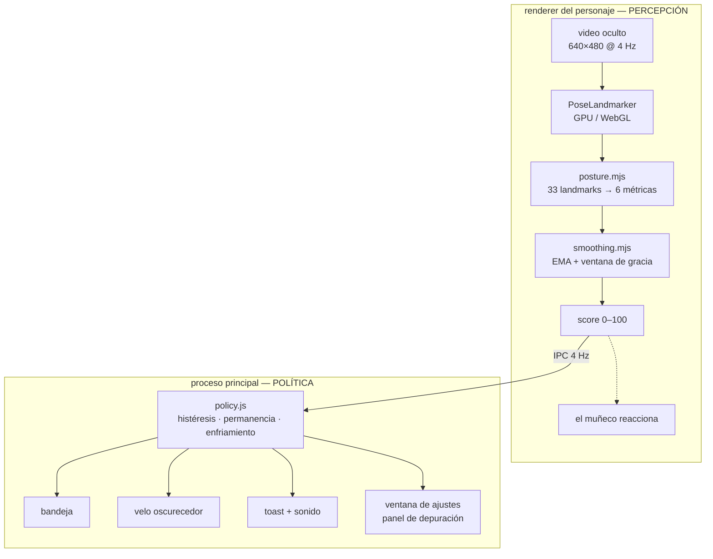

<div align="center">

# PosturePet

**Monitor de postura local con webcam para Windows.**
Sin nube, sin cuentas, sin telemetría — el modelo corre en tu equipo y la app
no hace **ninguna** conexión de red.

[](https://github.com/adriandy89/PosturePet/actions/workflows/ci.yml)
[](LICENSE)
[](https://nodejs.org)

</div>

---

## Índice

- [Qué hace](#qué-hace)
- [Instalación](#instalación)
- [Primer uso](#primer-uso)
- [Cómo detecta la postura](#cómo-detecta-la-postura)
- [Cuándo te avisa](#cuándo-te-avisa)
- [Perfiles de calibración](#perfiles-de-calibración)
- [Referencia de ajustes](#referencia-de-ajustes)
- [Arquitectura](#arquitectura)
- [Desarrollo](#desarrollo)
- [Empaquetado](#empaquetado)
- [Privacidad](#privacidad)
- [Solución de problemas](#solución-de-problemas)
- [Limitaciones conocidas](#limitaciones-conocidas)
- [Licencia y créditos](#licencia-y-créditos)

---

## Qué hace

Vigila tu postura con la webcam y te avisa cuando llevas rato mal sentado. Cinco
formas de aviso, **cada una activable por separado**:

| Aviso | Cómo es | Cuándo salta |
|---|---|---|
| **Icono de bandeja** | Cambia de color junto al reloj | Al instante |
| **Personaje en pantalla** | Se encorva cuando tú te encorvas | A los 3 s |
| **Oscurecer la pantalla** | Un velo negro se funde encima; los clics lo atraviesan | Al cumplirse la permanencia |
| **Notificación** | Toast de Windows diciendo *qué* corregir | Íd., con enfriamiento |
| **Sonido** | Dos notas suaves sintetizadas | Íd., con enfriamiento |

El personaje es una ventana transparente, siempre encima y **arrastrable**. No
solo cambia de color: adelanta y baja la cabeza reproduciendo lo que acaba de
detectar. Te enseña lo que estás haciendo, no solo que algo va mal.

Además: perfiles de calibración por montaje, auto-pausa cuando no hay nadie
delante, y un autodiagnóstico que dice en qué eslabón se rompe la cadena.

## Instalación

### Desde el código

```bash
git clone https://github.com/adriandy89/PosturePet.git
cd PosturePet
npm install     # descarga el modelo (5,8 MB) y prepara vendor/
npm start
```

Requiere **Node 22+** para las herramientas de desarrollo. La app empaquetada no
necesita Node instalado.

### Desde el instalador

Descarga `PosturePet Setup x.y.z.exe` de [Releases](https://github.com/adriandy89/PosturePet/releases)
o compílalo tú (ver [Empaquetado](#empaquetado)).

> **Instala con el instalador, no con el portable, si quieres notificaciones.**
> Windows asocia los toasts al `AppUserModelID` mediante el acceso directo del
> menú Inicio que crea el instalador. Sin él fallan en silencio.

Al abrirlo **SmartScreen avisará**: la app no está firmada (ver
[Limitaciones](#limitaciones-conocidas)). *Más información* → *Ejecutar de todas
formas*. Cada release incluye un `SHA256SUMS.txt` para comprobar antes la
descarga con `Get-FileHash <archivo> -Algorithm SHA256`; los binarios los
compila GitHub Actions desde el tag, no una máquina personal.

## Primer uso

La app arranca en la bandeja y abre Ajustes la primera vez.

1. **Siéntate como quieres estar** el resto del día. Erguido pero cómodo, no en
   una postura de examen que no vas a mantener.
2. Pulsa **«Calibrar postura»** y quédate quieto 3 segundos.
3. Listo. Esa es tu referencia.

**Sin calibrar la app no puede puntuar nada.** De frente no existe una postura
«correcta» universal: depende de tu cuerpo, tu silla y dónde tengas la webcam.
Todo lo que mide PosturePet es *desviación respecto a ti mismo*.

## Cómo detecta la postura

Todas las apps comerciales de este tipo (SitApp, Slouch Sniper, SitSense) usan
el mismo motor libre por debajo: **MediaPipe Pose de Google**. Lo que las
diferencia no es el modelo — es qué se mide con él y cuándo molestar.

### El problema de la cámara frontal

La mayoría de proyectos de GitHub que hacen esto calculan **inclinación de
cuello y torso**, copiando tutoriales que asumen una cámara **de perfil**. Tu
webcam está de frente, así que esas fórmulas no sirven: de frente no se ve la
curvatura de la espalda.

Lo que sí se ve de frente son otras seis señales, y son suficientes.

### La decisión que sostiene todo lo demás: la unidad de escala

Para que una medida en píxeles signifique algo hay que dividirla por una escala
de referencia. Lo evidente sería el ancho de hombros, y es lo que hacen casi
todos los proyectos parecidos.

**Es un error: el ancho de hombros _es_ postura.** Cambia si redondeas los
hombros, si giras el torso, si te encoges, incluso con la ropa que lleves.
Usarlo de denominador mete ruido postural en todas las métricas a la vez, y
encima de forma correlacionada — cuando una se equivoca, se equivocan todas
juntas.

La **separación entre los ojos** es una dimensión *rígida* del cráneo. No cambia
con ninguna postura. Solo cambia con la distancia a la cámara (que es justo lo
que queremos medir) y con el giro de la cara (que se detecta y se descarta).

```
                        ancho de hombros        separación entre ojos
  ¿cambia al encorvarse?      sí  ✗                     no  ✓
  ¿al girar el torso?         sí  ✗                     no  ✓
  ¿con la ropa?               sí  ✗                     no  ✓
  ¿con la distancia?          sí                        sí   ← lo que medimos
```

Esto además destraba la detección de hombros: al sacarlos del denominador, su
movimiento por fin se ve.

### Las seis métricas

Índices BlazePose usados: `0` nariz, `2`/`5` ojos, `11`/`12` hombros.
Sea **E** la separación entre ojos, **H** el punto medio de los hombros y
**O** el punto medio de los ojos.

| # | Métrica | Fórmula | Detecta | Sentido | Peso |
|---|---|---|---|---|---|
| 1 | **Cuello acortado** | `(H.y − O.y) / E` | Encorvarte **y** encoger/redondear hombros | solo acortar | **0.34** |
| 2 | **Acercamiento** | `E / E_base − 1` | La cabeza que avanza hacia la pantalla | solo acercarse | **0.28** |
| 3 | **Altura de hombros** | `(H.y − H_base.y) / E` | Escurrirte (abajo) **y** tensión (arriba) | ambos | 0.16 |
| 4 | **Inclinación de hombros** | ángulo de la recta de hombros | Ladeo lateral | ambos | 0.08 |
| 5 | **Ladeo de cabeza** | ángulo de la recta entre ojos | Cabeza torcida | ambos | 0.07 |
| 6 | **Deriva lateral** | `(H.x − H_base.x) / E` | Desplazarte del centro | ambos | 0.07 |

Cada desviación pasa por una rampa suave (*smoothstep*) entre un umbral `good`
(suelo de ruido) y uno `bad` (postura claramente mala) → *maldad* 0..1.

```
score = 100 × (1 − Σ pesoᵢ × maldadᵢ)
```

Las métricas de un solo sentido no penalizan la desviación contraria: echarse
hacia atrás o sentarse **más** erguido que tu base es una mejora, no un fallo.

> **Normalizar va después de restar.** Para una posición absoluta,
> `(raw − base) / escala` es correcto; `raw/escala − base/escala` no lo es,
> porque el origen del encuadre no es un punto del cuerpo. Ese error hacía que
> acercarse a la cámara desplazara el valor un 226 %.

### Por qué no se detectan los hombros redondeados «midiendo el ancho»

La tentación es detectar la protracción escapular viendo si el ancho de hombros
se estrecha. **No funciona.** La protracción es una *abducción* de la escápula:
se desliza lateralmente rodeando la caja torácica. En proyección frontal el
componente lateral y el de envolvimiento tiran en sentidos opuestos, y cuál gana
depende de la anatomía de cada uno. La literatura clínica lo mide de perfil,
con marcadores en C7 y el acromion.

Lo que **sí** se ve de frente es la consecuencia: los hombros suben hacia las
orejas y el cuello aparente se acorta. Eso es la métrica 1, y es fiable.

El ancho de hombros sí se calcula (`shoulderSpan`, hombros medidos en anchos de
cara) pero **no puntúa**: se usa solo para detectar que la calibración se ha
quedado obsoleta, porque es prácticamente una constante anatómica —
en las medidas reales sale alrededor de **4,4**, estable entre calibraciones.

### Mirar al teclado no es encorvarse

Las dos cosas bajan la cabeza, así que una sola métrica no las separa. Pero
geométricamente son distintas, y la literatura de ergonomía lo dice
explícitamente: la postura adelantada de cabeza es una **traslación** del
cráneo, mientras que mirar al teclado es una **flexión cervical**.

```
        ERGUIDO              MIRANDO ABAJO           ENCORVADO
                              (flexión)             (traslación)

         o o                     ---                    o o
          v                     o   o                    v
         ---                     ---                    ---
          |                       |                      |
     ojos-nariz               ojos-nariz             ojos-nariz
     normal                   ESCORZADO              normal
     ojo-ojo normal           ojo-ojo normal         ojo-ojo normal
```

Al flexionar el cuello, el eje vertical de la cara se escorza y la distancia
proyectada ojos–nariz se acorta. La separación entre ojos, al ser horizontal,
**no cambia con el cabeceo** y sirve de referencia. El cociente entre ambas es
la señal:

```
facePitch = (nariz.y − ojosMedio.y) / E      ← baja al mirar abajo
                                               se mantiene al encorvarse
```

Mientras estás mirando hacia abajo se **perdona** la métrica del cuello — pero
solo durante la ventana de gracia (25 s por defecto). Pasada, vuelve a contar:
estar con el cuello doblado varios minutos cansa igual, mires lo que mires.

En el panel de depuración la métrica perdonada aparece tachada y atenuada, para
que se vea que se sigue midiendo aunque no cuente.

### Por qué los umbrales de ángulo son tan anchos

El desplazamiento mediano entre frames de MediaPipe es **~0,01** en coordenadas
normalizadas. Sobre un ancho de hombros típico eso ya son **~1,5° de puro
temblor del modelo**, con cola hasta 4°. Un umbral de 3° quedaría *por debajo
del ruido* y marcaría mala postura sin que te hubieras movido.

A eso se suma que sostener el ratón sube un hombro varios grados de forma
continua y perfectamente normal. De ahí que los ángulos lleven umbrales anchos
(7°–22°), la mitad de peso, y un suavizado **tres veces más lento** que el
resto de métricas.

> El modelo `lite` es el que más tiembla, y la API nueva de MediaPipe Tasks
> eliminó el `smoothLandmarks` que tenía la antigua. El suavizado lo hace
> PosturePet por su cuenta, con una constante de tiempo distinta por métrica.

## Cuándo te avisa

El detector puede ser perfecto y aun así resultar insufrible si avisa cada vez
que alcanzas la taza de café. Cuatro mecanismos, cada uno contra un modo de
fallo concreto:

| Mecanismo | Contra qué | Por defecto |
|---|---|---|
| **Histéresis** | Quedarte en el umbral hace parpadear el estado | entra <60, sale >70 |
| **Permanencia** | Gestos breves: beber, girarte a hablar | 10 s |
| **Escalado** | Interrumpir antes de haber avisado en bajo | 0 s → 3 s → permanencia |
| **Enfriamiento** | Encorvarte sin parar = avisos sin parar | 2,5 min |

Y dos comportamientos más:

- **Auto-pausa** a los 5 s sin detectar a nadie. El icono se pone gris y no
  suena nada hasta que vuelves. Al volver, la permanencia empieza de cero:
  nadie merece un aviso en el primer segundo por cómo se ha sentado.
- **Un hueco breve de detección no reinicia la permanencia.** Girar la cabeza un
  segundo pierde los landmarks; si eso reiniciara el contador, una mala postura
  sostenida no llegaría a avisar nunca.

El enfriamiento afecta solo a notificación y sonido, que **interrumpen**.
Oscurecer y el personaje son ambientales: acompañan al estado mientras dure.

> Si algo te resulta pesado, casi siempre se arregla **subiendo un tiempo**, no
> bajando la sensibilidad.

## Perfiles de calibración

Tu postura correcta no es una sola: es tu postura correcta *vista desde esa
cámara*, en *esa* silla, a *esa* altura de mesa. Cambia de montaje y la base
deja de valer — y no falla de forma ruidosa, sino **silenciosa**: sigue
puntuando, solo que mal.

Cada montaje lleva su calibración y se cambia con un clic desde la bandeja:

```
  Perfil  ▸  ● Escritorio
             ○ Portátil
             ○ Mesa alta (sin calibrar)
```

Sirve igual si varias personas comparten el equipo: las proporciones corporales
de cada uno dan bases distintas.

Además la app **avisa sola** cuando detecta que tu torso se ve a otra escala que
cuando calibraste (por ejemplo si mueves la cámara), y sugiere recalibrar o
crear un perfil nuevo. Girarse a hablar no lo dispara: hace falta que sea
sostenido durante 30 s y con la cara de frente.

## Referencia de ajustes

Todo se guarda en `%APPDATA%\PosturePet\settings.json`.

### Avisos

| Ajuste | Por defecto | Qué hace |
|---|---|---|
| `alerts.tray` | activado | Icono de bandeja por color |
| `alerts.mascot` | activado | Personaje en pantalla |
| `alerts.dim` | activado | Oscurecer la pantalla |
| `alerts.toast` | activado | Notificación de Windows |
| `alerts.sound` | activado | Tono suave |
| `dimOpacity` | 0.35 | Intensidad del velo (0,1–0,7) |

### Sensibilidad

| Ajuste | Por defecto | Qué hace |
|---|---|---|
| `sensitivity` | 1.0 | Estrecha o ensancha todos los umbrales (0,5–2) |
| `smoothingMs` | 1000 | Constante de tiempo del suavizado. Más alto = score más estable y más lento |
| `enterBadBelow` | 60 | Score por debajo del cual se considera mala postura |
| `exitBadAbove` | 70 | Y por encima del cual se sale. La banda muerta evita el parpadeo |

### Tiempos

| Ajuste | Por defecto | Qué hace |
|---|---|---|
| `glanceGraceMs` | 25 000 | Cuánto se perdona mirar hacia abajo. **0 desactiva la gracia** |
| `dwellMs` | 10 000 | Aguantar mal antes de oscurecer/notificar |
| `nagCooldownMs` | 150 000 | Mínimo entre notificaciones y sonidos |
| `mascotDelayMs` | 3 000 | Cuándo se inquieta el personaje |
| `awayAfterMs` | 5 000 | Sin detección → auto-pausa |

### Sistema

| Ajuste | Por defecto | Qué hace |
|---|---|---|
| `cameraId` | `null` | Cámara a usar. `null` = la del sistema |
| `autoStart` | desactivado | Arrancar con Windows, directo a la bandeja |
| `profiles` | 1 perfil | Lista de perfiles con su calibración |
| `mascotPosition` | `null` | Dónde dejaste el personaje |

## Arquitectura



El renderer nunca decide si molestarte; el proceso principal nunca mira píxeles.

### Decisiones no obvias

**La cámara vive en la ventana del personaje, no en una oculta.** En Windows,
`backgroundThrottling: false` no surte efecto en ventanas a las que se ha
llamado `hide()` ([electron#31016](https://github.com/electron/electron/issues/31016)):
el bucle de inferencia acabaría congelándose a los pocos minutos. El personaje
es *always-on-top* y siempre visible, así que Chromium nunca lo considera de
fondo. Si lo desactivas **no se oculta**: se reduce a 1×1 transparente e inerte
al ratón, que sigue contando como visible.

**Protocolo `app://` propio en vez de `file://`.** MediaPipe carga su WASM con
`fetch()`, y Chromium bloquea `fetch` sobre `file://`. Un esquema propio marcado
como `standard` y `secure` se comporta como HTTPS a efectos de origen: `fetch`
funciona, el CSP se escribe con `'self'`, y no hay que desactivar `webSecurity`.

**Sin empaquetar en asar.** Todo se sirve por `app://`, que resuelve con
`net.fetch`; la capa que hace transparente el archivo asar está en el módulo
`fs`, no en la pila de red, así que el WASM daría 404 dentro de un asar.

**4 FPS, no 30.** Encorvarse tarda segundos, no milisegundos. Se usa
`setInterval`, no `requestAnimationFrame`, que se frena a ~1 Hz en segundo plano
incluso con el throttling desactivado
([electron#9567](https://github.com/electron/electron/issues/9567)).

**Iconos y sonido generados en código.** El icono de la app se dibuja con un
codificador PNG mínimo sobre `zlib`; los de bandeja son buffers BGRA; el tono es
Web Audio con envolvente exponencial. Cero binarios en el repositorio.

### Estructura

```
src/
├── main/                    proceso principal (CommonJS)
│   ├── main.js              ciclo de vida, ventanas, IPC, permisos
│   ├── policy.js          ★ cuándo avisar — el archivo que decide si usas la app
│   ├── hysteresis.js      ★ umbrales de entrada y salida
│   ├── profiles.js        ★ perfiles de calibración
│   ├── settings.js          config persistida (escritura atómica)
│   ├── protocol.js          esquema app://
│   ├── tray.js              icono recoloreado en vivo
│   ├── overlay.js           velo oscurecedor click-through
│   ├── notifier.js          toast + sonido, mensaje según la peor métrica
│   └── selftest.js          autodiagnóstico con informe a archivo
├── preload/                 puentes contextBridge (superficie mínima)
└── renderer/                ESM
    ├── posture.mjs        ★ landmarks → métricas → score
    ├── smoothing.mjs      ★ EMA por métrica + ventana de gracia
    ├── camera.mjs           getUserMedia + bucle a 4 Hz
    ├── mascot.*             el personaje + la cámara oculta
    ├── settings.*           ajustes + panel de depuración
    └── overlay.*            el velo

★ = lógica pura, sin Electron ni DOM. Es lo que tiene tests.
```

## Desarrollo

```bash
npm run dev        # con la consola del renderer redirigida al terminal
npm test           # 69 tests, ninguno necesita cámara
npm run selftest   # cadena completa contra tu webcam, con informe
```

Los tests cubren la lógica pura con landmarks sintéticos y el reloj inyectado,
así que media hora de sesión simulada cuesta microsegundos:

| Archivo | Qué verifica |
|---|---|
| `posture.test.mjs` | Cada gesto mueve **solo** su métrica; invarianza de escala; regresión del bug de ángulos |
| `policy.test.js` | El café no avisa; el enfriamiento aguanta; los huecos de detección no reinician nada |
| `smoothing.test.mjs` | EMA por métrica; la gracia caduca y se reinicia bien |
| `profiles.test.js` | Nunca queda sin perfiles; migración; cada base se conserva |
| `messages.test.mjs` | Ninguna métrica se queda sin mensaje de aviso |

El **panel de depuración** de Ajustes es la herramienta real de ajuste: provoca
cada gesto por separado y comprueba que solo sube la barra que le corresponde.

Ver [CONTRIBUTING.md](CONTRIBUTING.md) para las trampas del código de detección
(la mano de los landmarks, la envolvente de ángulos, el orden de normalización)
y cómo añadir una métrica.

## Empaquetado

```bash
npm run build          # instalador NSIS + portable en dist/
npm run build:nosign   # si lo anterior falla (ver abajo)
```

Produce dos artefactos de ~97 MB: `PosturePet Setup x.y.z.exe` (instalador) y
`PosturePet x.y.z.exe` (portable, sin instalación).

> **Si `npm run build` falla** con *«Cannot create symbolic link»*: es un
> problema conocido de electron-builder, no de este proyecto. Descarga un
> paquete de firma de código que contiene enlaces simbólicos de macOS, y crearlos
> en Windows exige privilegios. Dos salidas:
>
> - **`npm run build:nosign`** — funciona sin permisos. Único coste: el `.exe`
>   lleva el icono genérico de Electron (el instalador y los accesos directos sí
>   llevan el nuestro).
> - **Activar Modo Desarrollador** (Configuración → Sistema → Para
>   programadores). Un interruptor, sin permisos de administrador, y entonces
>   `npm run build` da el `.exe` con icono propio.

### Publicar una release

Los binarios que se publican no salen de una máquina local, sino de un runner de
Windows ([.github/workflows/release.yml](.github/workflows/release.yml)), que sí
tiene privilegio de enlace simbólico y por tanto nunca cae en `build:nosign`.
Se dispara con un tag de versión:

```bash
npm version patch                       # sube package.json y crea el tag
git push origin main --tags
```

El workflow verifica que el tag coincide con `package.json`, corre los tests,
compila, comprueba que `vendor/` viajó dentro del paquete, genera
`SHA256SUMS.txt` y publica la release con las notas de
[.github/RELEASE_NOTES.md](.github/RELEASE_NOTES.md).

## Privacidad

- **Todo el procesamiento es local.** El modelo de MediaPipe corre en tu GPU.
- **La imagen nunca se guarda ni se transmite.** El `<video>` va directo al
  detector; no hay grabación, ni capturas, ni buffer en disco.
- **Ni una sola conexión de red en tiempo de ejecución.** El modelo y el WASM se
  descargan una vez durante `npm install` y quedan en `vendor/`.
- **Cero telemetría, cero cuentas.**
- Lo único que se guarda son números: tu calibración y tus ajustes, en
  `%APPDATA%\PosturePet\settings.json`.

## Solución de problemas

Ejecuta **`npm run selftest`** primero: te dice en qué eslabón se rompe la
cadena y deja el informe en `%APPDATA%\PosturePet\selftest.log`.

| Síntoma | Causa probable |
|---|---|
| No abre la cámara | Configuración → Privacidad y seguridad → Cámara → *Permitir que las aplicaciones de escritorio accedan a la cámara*. Y que no la ocupe otra app |
| Ve imagen pero no detecta a nadie | Colócate de frente, con los **dos hombros** dentro del encuadre y luz suficiente |
| Las notificaciones no salen | Necesitan el acceso directo del menú Inicio que crea el instalador; sin él Windows no asocia el `AppUserModelID` |
| El score baila estando quieto | Sube «Estabilidad del score» |
| Avisa demasiado | Sube la permanencia y el enfriamiento antes de bajar la sensibilidad |
| Marca mal postura al escribir | Sube «Perdonar mirar hacia abajo» |
| Dejó de puntuar bien de golpe | ¿Moviste la cámara o cambiaste de silla? Recalibra o crea un perfil |
| El score se congela al minimizar | Revisa que la ventana del personaje siga activa (ver [Arquitectura](#arquitectura)) |

## Limitaciones conocidas

- **Solo Windows.** El núcleo de detección es multiplataforma, pero la bandeja,
  los toasts, el velo y el empaquetado están hechos para Windows.
- **Una cámara frontal no ve la espalda.** No se puede medir la curvatura
  lumbar ni distinguir del todo hombros redondeados de cabeza adelantada.
  Una cámara lateral daría mucho más, a costa de un montaje que casi nadie tiene.
- **La calibración es un compromiso.** Si calibras en una postura que no vas a
  mantener, la app te dará la lata todo el día.
- **Sin historial.** No hay gráficas, rachas ni exportación. Las métricas de
  historial solo dicen algo tras semanas de uso; primero que el detector acierte.
- **Sin firma de código.** Windows SmartScreen avisará al instalar. Firmar
  requiere un certificado de pago.

## Licencia y créditos

PosturePet se publica bajo la [licencia MIT](LICENSE).

Construido sobre:

| Proyecto | Licencia | Para qué |
|---|---|---|
| [MediaPipe](https://github.com/google-ai-edge/mediapipe) | Apache 2.0 | Motor de detección y modelo `pose_landmarker_lite` |
| [Electron](https://github.com/electron/electron) | MIT | Carcasa de escritorio |

**Sobre el código de otros proyectos de postura.** Los dos más parecidos a este
([batesposture](https://github.com/wtbates99/opencv2-posture-corrector) y
[pose-nudge](https://github.com/DDULDDUCK/pose-nudge)) son **AGPL-3.0**. Aquí no
se ha copiado código de ellos: su copyleft se contagiaría a todo PosturePet. Las
fórmulas geométricas son ideas matemáticas y están reimplementadas desde cero —
y además ajustadas a cámara frontal, en vez de heredar la suposición de cámara
de perfil que arrastran esos repositorios.
